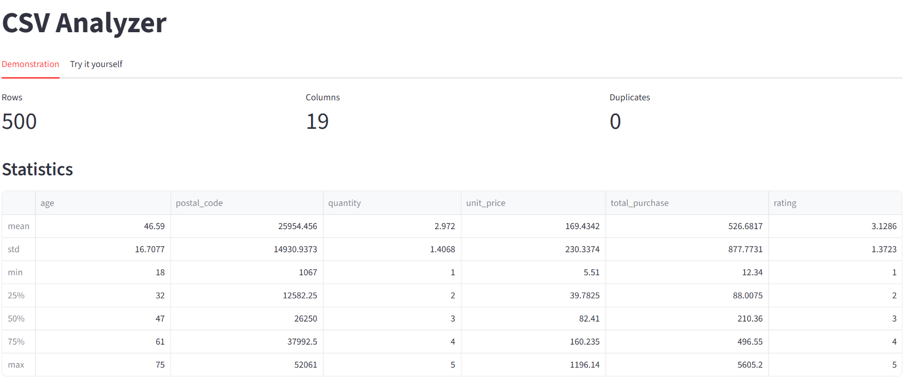
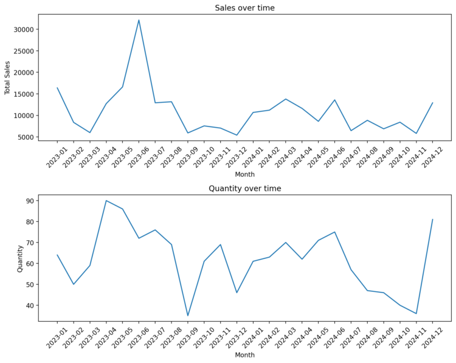
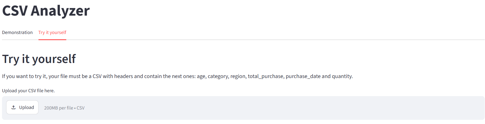

# CSV Analyzer

A small [Streamlit](https://streamlit.io/) app that takes any CSV file and produces an instant statistical summary and a set of charts, without writing a single line of code. Built as a portfolio piece to demonstrate data analysis, data visualization, and app development with Python.

## Screenshots





## Features

- **Demo tab**: preloaded sample dataset (`data/clients_purchases.csv`) with a full analysis ready to explore.
- **Try it yourself tab**: upload your own CSV and get the same analysis instantly.
- **Automatic summary**: row/column counts, duplicate count, missing values per column, and descriptive statistics.
- **Column inspector**: pick any column and see its data type, unique values, most frequent values, mean, median, and mode.
- **Charts**: sales by category, sales by region, sales over time, and age distribution (rendered only when the required columns are present).
- **Graceful error handling**: missing files, unreadable CSVs, or missing columns show a clear message instead of crashing the app.

## Project structure

```
CSV Analyzer/
├── app.py                  # Streamlit entry point
├── ui.py                   # Shared rendering logic for both tabs
├── utils/
│   ├── loader.py            # CSV loading with error handling
│   ├── analysis.py          # Summary statistics and column inspection
│   └── charts.py             # Matplotlib/Seaborn chart generation
├── data/
│   └── clients_purchases.csv # Sample dataset used in the demo tab
└── requirements.txt
```

## Requirements

- Python 3.12 (pinned in `.python-version`)
- Dependencies listed in `requirements.txt`: `pandas`, `streamlit`, `matplotlib`, `seaborn`

## Installation

```bash
git clone <repo-url>
cd "CSV Analyzer"
pip install -r requirements.txt
```

## Usage

```bash
streamlit run app.py
```

This opens the app in your browser (by default at `http://localhost:8501`).

- Go to **Demonstration** to explore the analysis on the sample dataset right away.
- Go to **Try it yourself** to upload your own CSV.

To get the full set of charts when uploading your own file, it should include these columns: `age`, `category`, `region`, `total_purchase`, `purchase_date`, `quantity`. If a column is missing, the app skips that specific chart and shows a warning instead of failing.

## Known limitations

This is a portfolio/demo project, not a production tool. A few trade-offs worth mentioning:

- Column validation checks that required columns **exist**, but not that they contain the expected data type (e.g. a text column named `age` won't raise an error, it will just produce a meaningless chart).
- Column names must match exactly (`age`, `category`, `region`, `total_purchase`, `purchase_date`, `quantity`, lowercase, no synonyms). There's no column mapping step, so a CSV using different naming conventions won't be recognized even if the data itself is equivalent.
- When a column has more than one mode (a tie), only one value is shown, picked arbitrarily by pandas, not flagged as a tie.
- No caching: the CSV is read and every statistic/chart is recomputed on every interaction (e.g. selecting a different column), not just on file upload. This is fine for small files but will get slow on large ones.
- No automated tests. Correctness has been checked manually and via ad hoc scripts during development, not via a test suite.

## Deployment note

The app is deployed on [Streamlit Community Cloud](https://csv-analyser-jlbou.streamlit.app/). If you redeploy it yourself, make sure the Python version is pinned to **3.12** in the deployment's "Advanced settings" (not just in `.python-version`, which Streamlit Cloud doesn't always honor). At the time of writing, Streamlit Cloud defaults new deployments to Python 3.14, which causes a `Segmentation fault` on startup because some native dependencies (numpy, pandas, matplotlib) don't yet have stable prebuilt wheels for that version.

## License

This project is available for portfolio/demonstration purposes.
